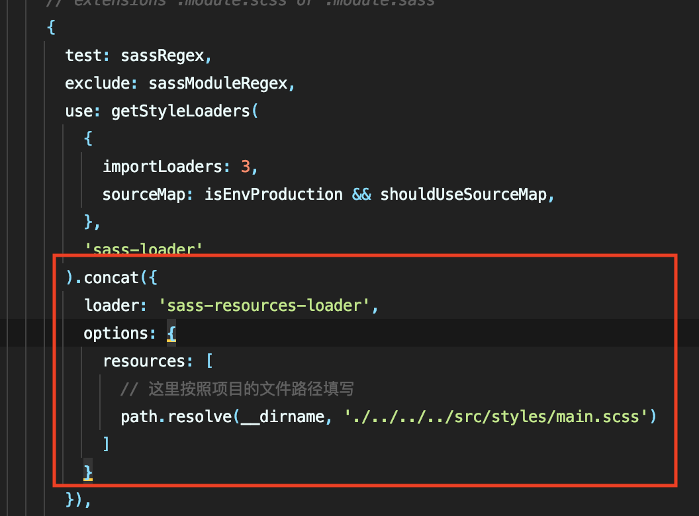
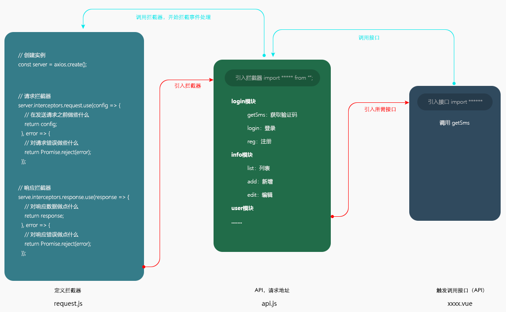

# React项目实战

教程官网：http://www.web-jshtml.cn/#/   视频地址：https://www.bilibili.com/video/BV1Hg4y167v6

**学习内容**：React v16，react-router4，redux, react-redux，Provider和connect，redux-saga，Redux-thunk，PropTypes，组件之间的通讯，调试工具，生命周期，React Hooks，Ant Design UI，Axios路由拦截；

**学习成效**：快速掌握React技术开发，完全自主搭建后台管理系统，路由权限；


## 第1课时

略。

## 第2课时

### 2.1 构建项目

环境安装（如果全局已安装则不需要）

```shell
$npm install -g create-react-app
```

创建项目

```shell
$npx create-react-app react-admin
```

运行项目

```shell
$npm start
```

显示隐藏文件（Webpack 或 Babel 等），注意此操作不可逆

```shell
$npm run eject
```

## 第3课时

### 3.1 react-router-dom

由于 react-router 提供了 router 的核心 api，包括 Router、Route、Switch 等，但是它没有提供 dom 操作进行跳转的 api，因此建议直接使用 React-router-dom，详见[官方文档](https://reacttraining.com/react-router/web/guides/quick-start)。

```shell
$npm install react-router-dom --save-dev
```

### 3.2 路由模式

```jsx
import { Switch, Route, Router, HashRouter, Link } from 'react-router-dom';

class App extends React.Component {
    render() {
        return (
            <HashRouter>
                <Switch>
                    <Route component={Home} exact path="/"/>
                    <Route component={About} path="/about"/>
                </Switch>
            </HashRouter>
        )
    }
}
```

解释说明：

1. Switch：在路径相同的情况下，只匹配第一个，这个可以避免重复匹配；例如上面的代码如果没有 Switch 来匹配 /about 的话， Home 和 About 都会显示，但是如果加上 Switch 来匹配 /about 的话，只会显示 Home 是因为第一个被匹配到了，这个时候就需要在 / 上添加 exact 精确匹配来避免了，/ 只有在完全匹配的时候才显示，部分匹配不显示。
2. exact：精准匹配。
3. 路由模式：
- HashRouter：使用 URL 中的 hash（#）部分去创建路由，举例来说，用户访问（简单的说就是URL上会带#号），访问地址会变成这种；http://www.example.com/#/xxxxxxxx
- BrowserRouter：URL 是指向真实 URL 的资源路径，当通过真实 URL 访问网站的时候。意思就是，不带 # 号的实际地址；项目上线后，需要后台处理 url 指向
- 其他模式略

### 3.3 sass 配置

```shell
$npm install node-sass@4.14.1 --save-dev
```

SASS全局变量

> SASS 全局变量的好处是不需要在每一份 scss 文件中使用都单独引入，项目中所有的scss文件均可使用变量和方法。

```shell
$npm install sass-resources-loader --D
```

在 node_modules/react-scripts/config/webpack.config.js 文件中进行配置：



```json
use: getStyleLoaders(
  {
    importLoaders: 3,
    sourceMap: isEnvProduction && shouldUseSourceMap,
  },
  'sass-loader'
).concat({
  loader: 'sass-resources-loader',
  options: {
    resources: [
      // 这里按照项目的文件路径填写（具体看情况哦！）
      path.resolve(__dirname, './../../../src/styles/main.scss')
    ]
  }
}),
```

上述 main.scss 主要是全局性的公共内容，例如重置样式、全局变量等等：

```scss
// 主要是全局性的公共内容
@import "normalize.scss";  // reset css 文件
@import "scssConfig.scss"; // 全局性 scss 变量
```

## 第4课时

### 4.1 Ant Design

```shell
$npm install antd --save
$npm install babel-plugin-import --save-dev (按需加载包)
```

注意 Ant Design 是按需引用，不像 element UI 你可以选择直接引入全部内容：

```jsx
import React from 'react';
import { Button } from 'antd';
import './App.css';

const App = () => (
  <div className="App">
    <Button type="primary">Button</Button>
  </div>
);

export default App;
```

另外还需要引入样式文件，在初始 `src/App.css` 文件的顶部引入 `antd/dist/antd.css`，注意本项目中已使用全局变量，可以在 `styles/main.scss` 中引入 `@import '~antd/dist/antd.css';`

```scss
@import '~antd/dist/antd.css';
```

### 4.2 Fragment 包裹标签

使用 `<div></div>` 来包裹内容的话会渲染出div标签来，可能会产生冗余标签，如果既能包裹内容又能不渲染新的标签的话可以使用 ` <Fragment></Fragment>`（在vue中我们使用`<template></template>`来包裹内容）。

注意，使用Fragment时需要引入，或者使用React.Fragment：

```js
import {Fragment} from 'react'
```

## 第5课时

### 5.1 函数定义方法

1、箭头函数声明（常用）

```react
class Account extends React.Component {
    click = () => {
        alert('click')
    }

    render() {
        return (
            <div>
                <button onClick={this.click}>点击</button>
            </div>
        )
    }
}
```

2、构造器内声明 - bind绑定

```react
class Account extends React.Component {
    constructor(props) {
        super(props);
        this.click = this.click.bind(this)
    }

    click() {
        alert('click')
    }

    render() {
        return (
            <div>
                <button onClick={this.click}>点击</button>
            </div>
        )
    }
}
```

3、直接bind绑定，与2的区别在于在使用处绑定this

```react
class Account extends React.Component {
    click() {
        alert('click')
    }

    render() {
        return (
            <div>
                <button onClick={this.click.bind(this)}>点击</button>
            </div>
        )
    }
}
```

4、使用时使用箭头函数

```react
class Account extends React.Component {
    click() {
        alert('click')
    }

    render() {
        return (
            <div>
                <button onClick={() => this.click()}>点击</button>
            </div>
        )
    }
}
```

## 第5课时

略。

## 第6课时

略。

## 第7课时

### 7.1 跨域配置

1、安装依赖 - http-proxy-middleware

```shell
$npm i http-proxy-middleware
```

2、创建文件src/setupProxy.js

```js
const { createProxyMiddleware } = require('http-proxy-middleware');

module.exports = function (app) {
    app.use(createProxyMiddleware("/devApi", {
        target: "http://www.web-jshtml.cn/api/react", //配置你要请求的服务器地址
        changeOrigin: true,
        pathRewrite: {
            "^/devApi": "",
        },
    }))
};
```

### 7.2 请求拦截器

1、安装依赖

```shell
$npm i axios --save
```

2、拦截器 interceptor.js

```javascript
import axios from 'axios'

// 第一步：创建实例
const service = axios.create({
    baseURL: "/devApi"
    timeout: 5000,
})

// 第二步：请求拦截
service.interceptors.request.use((config) => {
    // 在发送请求之前做些什么
    return config
}, (error) => {
    // 对请求错误做些什么
    return Promise.reject(error)
})

// 第三步：响应拦截
service.interceptors.response.use((response) => {
    // 对响应数据做点什么
    return response
}, (error) => {
    // 对响应错误做点什么
    return Promise.reject(error)
})

export default service
```



### 7.3 项目环境（变量）

**项目环境**

- 开发环境 - npm start
- 测试环境（线上服务器-对内）- npm run test 
- 生成环境（线上服务器-对外）- npm run build

**环境变量**

create-react-app 创建的项目有内置的环境变量 NODE_ENV，可通过 `process.env.NODE_ENV` 读取变量，默认为 3 个值：development（开发）、test（测试）、production（生产） 。另外也可以创建文件 `.env.development`、`.env.production`、`.env.test` 来自定义环境变量，里面的环境变量必须以 `REACT_APP_` 开头，其他地方可以通过 `process.env.变量名 `获取。

```javascript
// .env.development
REACT_APP_API = "/devApi" //注意，自定义一定是 REACT_APP_ 开头

// 其他地方
process.env.REACT_APP_API
```

## 第8课时

### 8.1 双向绑定的区别

React 不同于 Vue 存在 v-model 可以实现双向绑定，React 中表单等需要通过监听函数来实现对数据的更新。

```jsx
class Demo extends React.Component{
  constructor(){
    super();
    this.state = {
      num: 0,
    }
  }
  
  changeNum = (e) => {
    this.setState({
      num: e.target.value
    });
  }
  
  render(){
    const { num } = this.state;
    return (
      <div>
        <input value={num} onChange=this.changeNum/>
      </div>
    )
  }
}
```

## 第9课时

略。

### 第10课时

### 10.1 组件类型

1、无状态组件（函数组件）

> 无状态组件是最基础的组件形式，由于没有状态的影响所以就是纯静态展示的作用。属性（props）加上一个渲染函数（render）。复用性比较强。

```react
function Component(props) {
  let name = 'Sherwin'
  return (
    <div>hello world, {name}!</div>
  )
}
```

2、有状态组件

> 组件内部包含状态（state）且状态随着事件或者外部的消息而发生改变。有状态组件通常会带有生命周期(lifecycle)。

```react
import React from 'react'

class Component extends React.Component {
  constructor(props){
    super(props)
    this.state = {
      name: 'Sherwin'
    }
  }
  render() {
    const {name} = this.state 
    return ({
       <div>hello world, {name}!</div>
    })
  }
}
```

3、UI组件

> 负责数据的渲染，通过属性 props 接收外部数据加上 render 函数。

4、容器组件

> axios 数据的获取以及处理逻辑上的事，不负责数据的渲染。

5、高阶组件

> 复用组件逻辑时，它们是 JavaScript 函数，将组件作为参数并返回一个新组件。

### 10.2 生命周期

> 具体详见[React生命周期](https://sherwinshen.gitbook.io/front-end-blog/frameworks/react/react-lifeCycle)

举例 - props同步接收其变化：

```jsx
class Demo extends React.Component{
  constructor(props){
    super(props);
    this.state = {
      username: this.props.username // 这里面是初始化默认值，后续更新不会获取到
    }
  }
  
  render(){
    return (<div>{this.props.name}</div>)  // 外面调用this.props则每次都会去获取一次，能过获取到最新的
  }
}
```

每一次都利用this.props去获取其实没有必要，因此我们需要利用生命周期函数来同步props变化：

```jsx
class Demo extends React.Component{
  constructor(props){
    super(props);
    this.state = {
      username: this.props.username // 这里面是初始化默认值，后续更新不会获取到
    }
  }
  
  // 更新props的时候同步更新username
  static getDerivedStateFromProps(nextProps) {
    return { username: nextProps.username };
  }
  
  render(){
    return (<div>{this.state.username}</div>) // 此时state里面的username也同步更新了
  }
}
```

## 第11课时

### 11.1 密码加密

安装依赖

```shell
$npm install crypto-js
```

加密使用

```javascript
// md5加密
const pwd = CryptoJs.MD5(password).toString();

// SHA1
const pwd = CryptoJS.SHA1(password).toString();

// AES加密 - 第二个参数为秘钥(自定义)
const secretKey = 'sherwinShen';
const pwd = CryptoJS.AES.encrypt(password, secretKey).toString();
```

## 第12课时

### 12.1 withRouter

默认情况下必须是经过路由匹配渲染的组件才拥有路由参数并使用编程式导航的写法，如执行this.props.history.push('/detail')跳转到对应路由的页面，然而不是所有组件都直接与路由相连的，例如项目中LoginForm组件是在Home组件中的，Home组件才是直接与路由相连，当这些组件需要路由参数时，使用withRouter就可以给此组件传入路由参数，此时就可以使用this.props.history.push('/detail')。总结：路由组件可直接获取 history、location 和 match 等属性，而非路由组件必须通过 withRouter 修饰后才能获取这些属性了，比如

```react
<Route path='/' component={App}/>
```

App 组件就可以直接获取路由中这些属性了，但是，如果 App 组件中如果有一个子组件 Foo，那么 Foo 就不能直接获取路由中的属性了，必须通过 withRouter 修饰后才能获取到。

```react
// Foo.js
import React from 'react';
import { withRouter } from 'react-router-dom';

class Foo extends React.Component {
  constructor(props) {
    super(props);
    this.state = {};
  }

  go = () =>{
    this.props.history.push('/home');
  }
  
  render() {
    return (
      <div onClick={this.go}>
        This is Foo.
      </div>
    );
  }
}

export default withRouter(Foo);
```

上述 Foo 组件通过 withRouter 加工后的组件 props 会有 history 属性，这时就可以通过 history 的 push 方法跳转路由了。

## 第13课时

### 13.1 私有化路由

原本路由的书写方式：

```react
<HashRouter>
  <Switch>
    <Route component={Home} exact path="/"/>
    <Route component={About} path="/about"/>
  </Switch>
</HashRouter>
```

我们可以将 ` <Route component={About} path="/about"/>` 整个作为一个组件：

```react
import React from 'react'
import {Route} from 'react-router-dom'

const PrivateRoute = ({component: Component, ...rest}) => {
    return (
        <Route
            {...rest}
            render={routeProps => (
          			// 此处可以做一些拦截操作，例如验证是否有权限进入
          			// true ? <Component {...routeProps} /> : <redirct to='/login'/>
                <Component {...routeProps} />
            )}
        />
    );
}

export default PrivateRoute
```

```react
import PrivateRoute from 'privateRoute.js'

<HashRouter>
  <Switch>
    <PrivateRoute component={Home} exact path="/"/>
  </Switch>
</HashRouter>
```

### 13.2 权限验证

1、登录完成，存储 token 至 sessionStorage

```javascript
export function setToken(data) {
    sessionStorage.setItem('adminToken', data)
}
```

2、在路由跳转的时候在 [13.1 私有化路由](#131 私有化路由) 中跳转进行判断是否有 token

```javascript
export function getToken() {
    return sessionStorage.getItem('adminToken')
}
```

```react
import React from 'react'
import {Route} from 'react-router-dom'
import {getToken} from 'token.js'

const PrivateRoute = ({component: Component, ...rest}) => {
    return (
        <Route
            {...rest}
            render={routeProps => (
          			getToken() ? <Component {...routeProps} /> : <redirct to='/'/>
            )}
        />
    );
}

export default PrivateRoute
```

## 第14课时

略。

## 第15课时

### 15.1 路由权限


这里的路由权限不是说是否有权限登录该路由，而是针对不同的用户权限，显示不同的路由列表，如图所示的路由列表，我们是通过自定义的渲染函数进行渲染的，因此可以在该渲染函数的生命周期 componentDidMount 中添加一层“拦截”，实现过滤路由。

## 第16课时

### 16.1 自动化工程-生成组件

```jsx
import React, { Component } from 'react';
import { Switch } from 'react-router-dom';
import PrivateRoute from '../../components/privateRoute';

import User from './../user/index';
import UserAdd from '../user/userAdd';

class Content extends Component {
  constructor(props) {
    super(props);
    this.state = {};
  }

  render() {
    return (
      <div className="content">
        <Switch>
          <PrivateRoute component={User} path="/index/user/list" />
          <PrivateRoute component={UserAdd} path="/index/user/add" />
        </Switch>
      </div>
    );
  }
}

export default Content;
```

如上面代码所示，每需要一个路由就引入一个组件，并添加对应的PrivateRoute组件，这十分不方便，也不利于配置，因此可以使用自动化工程的方式自动读取。

```jsx
import React, { Component } from 'react';
import { Switch } from 'react-router-dom';
import PrivateRoute from '../../components/privateRoute';

// 建立上下文件关系
// 第一个参数：目录; 第二参数：是否查找子级目录; 第三参数：指定查找到文件
const files = require.context("./../views/", true, /\.js$/);
const Components = [];
files.keys().map((key) => {
  if (key.includes("./home/") || key.includes("./login/")) {
    return false;
  }
  // path
  const path = `/index${key.split(".")[1].toLowerCase()}`;
  // component
  const component = files(key).default;
  // 写入对象
  Components.push({
    path,
    component,
  });
  return true;
});

class Content extends Component {
  constructor(props) {
    super(props);
    this.state = {};
  }

  render() {
    return (
      <div className="content">
        <Switch>
          {Components.map((item, index) => {
            return (
              <PrivateRoute component={item.component} path={item.path} key={index}/>
            );
          })}
        </Switch>
      </div>
    );
  }
}

export default Content;
```

## 第17课时

### 17.1 cookie 验证权限

可选插件：

```shell
$ npm install react-cookies --save
```

使用：

```js
import cookie from 'react-cookies'

cookie.save(name, value, [options])
cookie.remove(name, [options])
```

我们在登陆的时候后台返回了token和username，可以将其保存在cookie中，并且在请求拦截器中对请求头加上该数据，后台则能够对身份进行验证。

```js
// 请求拦截
service.interceptors.request.use(
  (config) => {
    // 在发送请求之前做些什么 - 请求头添加内容，权限验证
    config.headers["Token"] = getToken();
    config.headers["Username"] = getUsername();
    return config;
  },
  (error) => {
    // 对请求错误做些什么
    return Promise.reject(error);
  }
);
```

## 第18课时

### 18.1 响应数据业务逻辑

响应拦截器这边可以基于http code和约定的resCode来做一些全局性的设置：

```js
// 响应拦截
service.interceptors.response.use(
  (response) => {  // httpCode为200时，对响应数据做点什么
    const data = response.data;
    // 约定resCode为0时，表示请求成功
    if (data.resCode === 0) {
      return response;
    }
    // 约定resCode不为0时，表示请求出现问题
    message.info(data.message); // 全局的错误拦截提示
    // // 可以针对某些 resCode 值，进行业务逻辑处理，即白名单
    // if (data.resCode === 1023) {
    //   console.log();
    // }
    return Promise.reject(response); // 进入下方的逻辑，等同于httpCode不为200
  },
  (error) => { // httpCode不为200时，对响应错误做点什么
    return Promise.reject(error);
  }
);
```

## 第19课时

略。

## 第20课时

### 20.1 路由传参

1、params传参（刷新页面后参数不消失，参数会在地址栏显示）

```jsx
// 传递方式
// 第一种：路由页面
<Route path='/link/:id' component={Demo}></Route>
// 第二种：链接方式
<Link to={'/link/?id=' + 'xxx'}>首页</Link> 
<Link to={{pathname:'/link/' + 'xxx'}}>首页</Link>
// 第三种：js方式
this.props.history.push('/link/' + 'xxx')
this.props.history.push({pathname:'/ link /' + 'xxx'})

// 获取参数方式
this.props.match.params.id // 注意这里是 match 而非 history
```

2、query传参（刷新页面后参数消失）

```jsx
// 传递方式
// 第一种：路由页面
<Route path='/link' component={Demo}></Route>  // 无需配置 路由跳转并传递参数
// 第二种：链接方式
<Link to={{pathname:'/link ',query:{id:22, name:'dahuang'}}}>XX</Link>
// 第三种：js方式
this.props.history.push({pathname:'/link',query:{id:22, name:'dahuang'}}) 

// 获取参数方式
this.props.location.query.name
```

 3、state传参（刷新页面后参数消失，state传的参数是加密的）

```jsx
// 传递方式
// 第一种：路由页面
<Route path='/link' component={Demo}></Route>  // 无需配置 路由跳转并传递参数
// 第二种：链接方式
 <Link to={{pathname:'/link ',state:{id:12, name:'dahuang'}}}>XX</Link>
// 第三种：js方式
this.props.history.push({pathname:'/link',state:{id:12, name:'dahuang'}}) 

// 获取参数方式
this.props.location.state.name
```

## 第21课时

略。

## 第22课时

### 22.1 数据类型检测

```js
import PropTypes from 'prop-types';
```

propTypes 提供一系列验证器，可用于确保组件接收到的数据类型是有效的。当传入的 prop 值类型不正确时，JavaScript 控制台将会显示警告。出于性能方面的考虑，propTypes 仅在开发模式下进行检查。

```js
MyComponent.propTypes = {
  // 你可以将属性声明为 JS 原生类型，默认情况下这些属性都是可选的。
  optionalArray: PropTypes.array,
  optionalBool: PropTypes.bool,
  optionalFunc: PropTypes.func,
  optionalNumber: PropTypes.number,
  optionalObject: PropTypes.object,
  optionalString: PropTypes.string,
  optionalSymbol: PropTypes.symbol,

  // 任何可被渲染的元素（包括数字、字符串、元素或数组） (或 Fragment) 也包含这些类型。
  optionalNode: PropTypes.node,

  // 一个 React 元素。
  optionalElement: PropTypes.element,

  // 一个 React 元素类型（即，MyComponent）。
  optionalElementType: PropTypes.elementType,

  // 你也可以声明 prop 为类的实例，这里使用 JS 的 instanceof 操作符。
  optionalMessage: PropTypes.instanceOf(Message),

	// 你可以让你的 prop 只能是特定的值，指定它为枚举类型。
  optionalEnum: PropTypes.oneOf(['News', 'Photos']),

  // 一个对象可以是几种类型中的任意一个类型
  optionalUnion: PropTypes.oneOfType([
    PropTypes.string,
    PropTypes.number,
    PropTypes.instanceOf(Message)
  ]),

  // 可以指定一个数组由某一类型的元素组成
  optionalArrayOf: PropTypes.arrayOf(PropTypes.number),

  // 可以指定一个对象由某一类型的值组成
  optionalObjectOf: PropTypes.objectOf(PropTypes.number),

  // 可以指定一个对象由特定的类型值组成
  optionalObjectWithShape: PropTypes.shape({
    color: PropTypes.string,
    fontSize: PropTypes.number
  }),
  
	// An object with warnings on extra properties
  optionalObjectWithStrictShape: PropTypes.exact({
    name: PropTypes.string,
    quantity: PropTypes.number
  }),   

 	// 你可以在任何 PropTypes 属性后面加上 `isRequired` ，确保这个 prop 没有被提供时，会打印警告信息。
  requiredFunc: PropTypes.func.isRequired,  
  
  // 任意类型的数据
  requiredAny: PropTypes.any.isRequired,

  // 你可以指定一个自定义验证器。它在验证失败时应返回一个 Error 对象。
  // 请不要使用 `console.warn` 或抛出异常，因为这在 `onOfType` 中不会起作用。
  customProp: function(props, propName, componentName) {
    if (!/matchme/.test(props[propName])) {
      return new Error(
        'Invalid prop `' + propName + '` supplied to' +
        ' `' + componentName + '`. Validation failed.'
      );
    }
  },

  // 你也可以提供一个自定义的 `arrayOf` 或 `objectOf` 验证器。
  // 它应该在验证失败时返回一个 Error 对象。
  // 验证器将验证数组或对象中的每个值。验证器的前两个参数
  // 第一个是数组或对象本身
  // 第二个是他们当前的键。
  customArrayProp: PropTypes.arrayOf(function(propValue, key, componentName, location, propFullName) {
    if (!/matchme/.test(propValue[key])) {
      return new Error(
        'Invalid prop `' + propFullName + '` supplied to' +
        ' `' + componentName + '`. Validation failed.'
      );
    }
  })
};
```

### 22.2 数据默认值

> 我们可以对组件的props设置默认值：

```js
// 指定 props 的默认值：
MyComponent.defaultProps = {
  name: 'Stranger'
};
```

### 22.3 setState

`setState()` 可视为请求而不是立即更新组件的命令，React 会延迟调用它，然后通过一次传递更新多个组件。`setState()` 并不总是立即更新组件。它会批量推迟更新。这使得在调用 `setState()` 后立即读取 `this.state` 成为了隐患。为了消除隐患，请使用 `componentDidUpdate` 或者 `setState` 的回调函数（`setState(updater, callback)`）。

```js
setState(updater, [callback])
```

第一个参数可接受函数和对象类型：

```js
this.setState((state, props) => {
  return {counter: state.counter + props.step};
});

this.setState({quantity: 2});
```

### 22.4 父组件调用子组件方法

在父组件获取子组件的实例
1、在子组件调用父组件方法，并把子组件实例传回给父组件，（已经存储了子组件的实例）
2、通过实例调用子组件的方法

```jsx
class Parent extends Component {
  constructor(props){
    super(props);
    this.state = {};
  }
  
  getRef = (ref) => {
    this.childComponent = ref;
    // 此时我们就能在其他地方通过this.childComponent.XXX来使用子组件的方法
  }
  
  render(){
    return (
      <Child onRef={this.getRef} />
    )
  }
}


class Child extends Component {
  constructor(props){
    super(props);
    this.state = {};
  }
  
  componentDidMount() {
    this.props.onRef && this.props.onRef()
  }
  
  render(){}
}
```

### 22.5 组件封装

组件封装可以考虑分为两块来进行：

- UI组件：负责数据的渲染，通过属性 props 接收外部数据加上 render 函数。
- 容器组件：axios 数据的获取以及处理逻辑上的事，不负责数据的渲染。

例如，本项目中的tableData组件等。

## 第23课时

### 23.1 state之对象的更新

```jsx
class Demo extends Component {
  constructor(props){
    super(props);
    this.state = {
      obj: {
        item: 'item',
        obj: 'name'
      }
    };
  }
  
  update = (value) => {
    // 错误做法
    this.setState({
      obj: {
        obj: value,
      }
    })
    // 正确做法
    this.setState({
      obj: {
        ...this.state.obj,
        obj: value,
      }
    });
  }
  
  render(){
    return ()
  }
}
```

注意，更新state的obj.obj时，如果使用错误方法，则obj.item会被清除，正确的方法是使用es6的语法，在最前面多加一行`...this.state.obj`，因为如果重复的话后面的则会覆盖前面的。

## 第24课时

### 24.1 Redux

```
npm install --save redux
```

Redux的4大核心： Store + State + Action + Reducer


文档内容详见[redux文档](https://www.redux.org.cn)，个人总结详见[前端学习笔记 - Redux指南](https://sherwinshen.gitbook.io/front-end-blog/frameworks/react/redux)。

## 第25课时

### 25.1 react-redux

```
npm install --save react-redux
```

React-Redux 将所有组件分成两大类：UI 组件（presentational component）和容器组件（container component）。

- UI组件（presentational component）

  - 只负责 UI 的呈现，不带有任何业务逻辑
  - 没有状态（即不使用this.state这个变量）
  - 所有数据都由参数（this.props）提供
  - 不使用任何 Redux 的 API
- 容器组件（container component）
  - 负责管理数据和业务逻辑，不负责 UI 的呈现
  - 带有内部状态
  - 使用 Redux 的 API

React-Redux 的一些关键概念：

- **mapStateToProps** —— return state，尽量取最小范围的值，不要取不需要的state属性，对性能有一定消耗。
- **mapDispatchToProps** —— return 一个 dispatch 执行一个 action，在组件内可以用 this.props 解构。
- **Provider** —— 是顶层组件的作用，将store作为上下文提供给全局共享。
- **connect** —— 组件是局部组件，将某个react组件包装起来，传递指定的state和props给该组件访问。

具体详见[说明文档](https://www.redux.org.cn/docs/basics/UsageWithReact.html)。